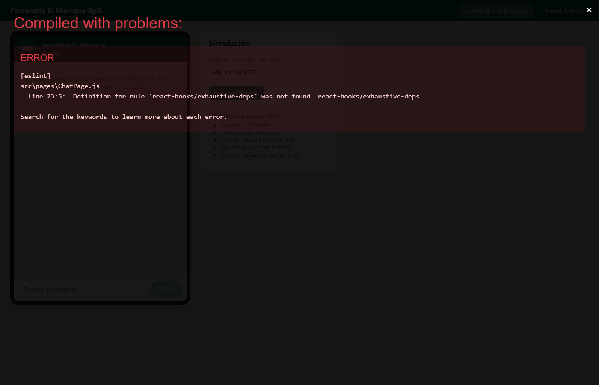
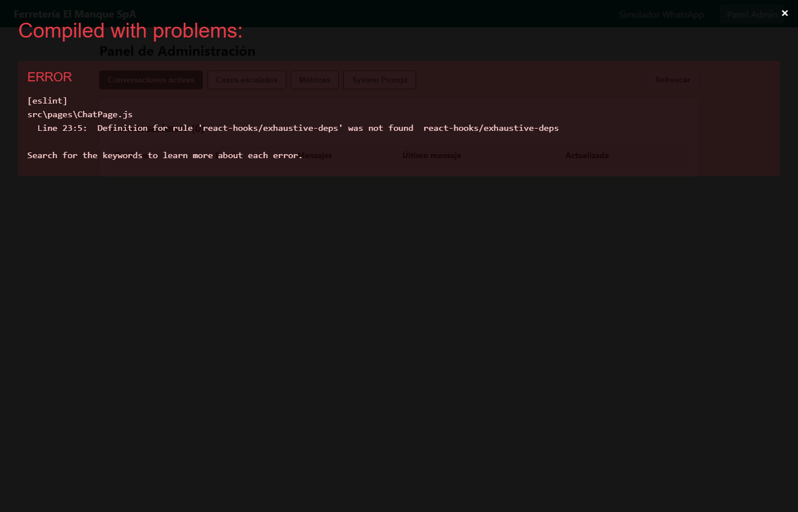

# Chatbot WhatsApp Simulado - Ferretería El Manque SpA

Sistema de atención al cliente vía WhatsApp simulado para una PyME chilena ficticia (Ferretería El Manque SpA). Incluye un simulador de interfaz tipo WhatsApp en React, un backend Node.js + Express con integración a un servicio LLM genérico (mockeable), persistencia en SQLite y un panel de administración con métricas.


## Pantallas





## Autor

- **Hector Riquelme** (GitHub: [HectorRiquelme](https://github.com/HectorRiquelme))

## Características

- Simulador de interfaz WhatsApp (burbujas verdes, hora, ticks de doble check).
- Backend Express con endpoints REST para envío de mensajes, historial y panel admin.
- Cliente LLM genérico configurable vía variables de entorno (`LLM_API_KEY`, `LLM_ENDPOINT`, `LLM_MODEL`).
- Modo desarrollo (`LLM_MODE=mock`) con respuestas canned basadas en keywords (sin llamadas de red).
- Escalamiento a agente humano cuando el LLM no puede resolver (marca el caso como `escalado`).
- Persistencia en SQLite: historial completo por número de teléfono simulado.
- Panel admin con:
  - Conversaciones activas
  - Casos escalados
  - Métricas: mensajes por día, tasa de resolución, temas frecuentes
  - Editor del system prompt (empresa, horarios, servicios, precios CLP, política de devolución, FAQ)

## Estructura

```
02_chatbot_whatsapp_pyme/
├── backend/
│   ├── src/
│   │   ├── index.js
│   │   ├── config.js
│   │   ├── db/
│   │   │   └── database.js
│   │   ├── services/
│   │   │   ├── llmClient.js
│   │   │   ├── mockResponder.js
│   │   │   └── chatService.js
│   │   └── routes/
│   │       ├── chat.js
│   │       └── admin.js
│   ├── data/                 # archivo SQLite generado al ejecutar
│   ├── .env.example
│   └── package.json
└── frontend/
    ├── public/
    │   └── index.html
    ├── src/
    │   ├── index.js
    │   ├── App.js
    │   ├── App.css
    │   ├── api.js
    │   ├── components/
    │   │   ├── ChatWindow.js
    │   │   ├── MessageBubble.js
    │   │   └── MessageInput.js
    │   └── pages/
    │       ├── ChatPage.js
    │       └── AdminPage.js
    └── package.json
```

## Requisitos

- Node.js 18+
- npm 9+

## Instalación

> Nota: las dependencias están listadas en los `package.json` pero **no** se instalan automáticamente.

### Backend

```bash
cd backend
npm install
cp .env.example .env
npm run dev
```

El backend quedará disponible en `http://localhost:4000`.

### Frontend

```bash
cd frontend
npm install
npm start
```

El frontend quedará disponible en `http://localhost:3000`.

## Variables de entorno (backend/.env)

```
PORT=4000
LLM_MODE=mock                 # mock | live
LLM_API_KEY=tu_api_key_aqui
LLM_ENDPOINT=https://api.llm-provider.example/v1/chat/completions
LLM_MODEL=generic-chat-model
DB_PATH=./data/chatbot.sqlite
```

En modo `mock` no se realiza ninguna llamada HTTP: el cliente responde mediante coincidencia de keywords (precios, horarios, devoluciones, etc.).

## Endpoints principales

### Chat
- `POST /api/chat/send` → `{ phone, text }`
- `GET  /api/chat/history/:phone`

### Admin
- `GET  /api/admin/conversations`
- `GET  /api/admin/escalated`
- `GET  /api/admin/metrics`
- `GET  /api/admin/prompt`
- `PUT  /api/admin/prompt` → `{ system_prompt }`

## Uso

1. Abrir el simulador WhatsApp en `http://localhost:3000`.
2. Escribir mensajes como "precio del taladro", "horario de atención", "quiero devolver", "hablar con humano".
3. Revisar el panel admin en `http://localhost:3000/admin`.
4. Desde el panel, editar el system prompt y ver métricas en vivo.

## Empresa ficticia

**Ferretería El Manque SpA** — PyME ficticia con sede en Rancagua, Región de O'Higgins, Chile. Vende herramientas, materiales de construcción y artículos de ferretería. Todos los precios están expresados en pesos chilenos (CLP).
